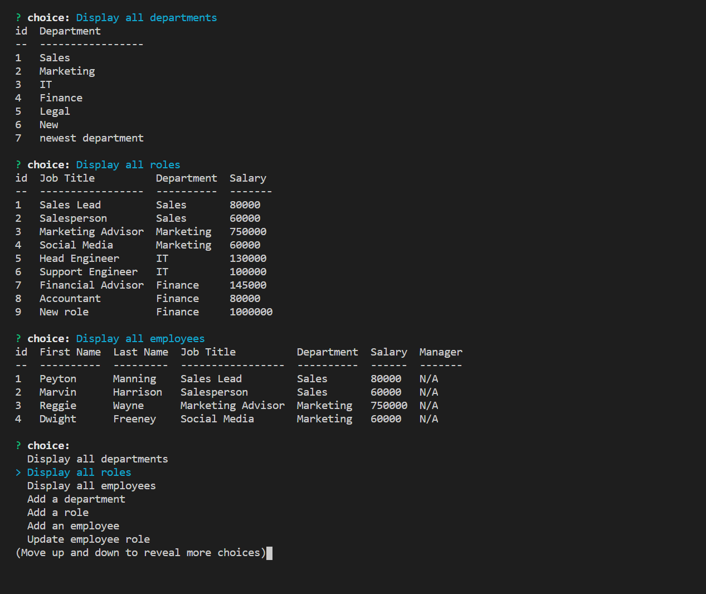

# Employee Manager

## Description 
A command-line application to manage a company's employee database, using Node.js, Inquirer, and MySQL.

## Table of Contents
* [Installation](#installation) 
* [Usage](#usage) 
* [License](#license) 
* [Contributing](#contributing)
* [Questions](#questions)

 
### Installation
Clone or fork the code from the Employee Manager repository on GitHub. Open the code in a standard code editing application, such as VS Code. Be sure to have MySQL, npm inquirer, console.table and easy-table installed from the terminal.
### Usage
Use the integrated terminal in your preferred code-editing application to enter in the command "node server.js". Follow the prompts to create, edit and view a new company database.
### Demonstration Video

### Contributing
Notable is an open source project, and anyone is encourged to contribute by cloning or forking the code and working to improve its function and versatility.

### Questions
    
##### Interested in other projects from this developer? Visit the following GitHub profile:
https://github.com/mplumer
    
##### Send any questions to the following email address:
maxplumer12@gmail.com